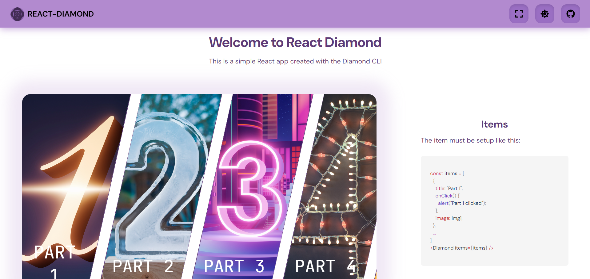

# Template React Diamond

This project serves as an example of how to use the `react-diamond` library. The `react-diamond` library is available on npm and can be found [here](https://www.npmjs.com/package/react-diamond). The source code for the library is available on GitHub at [github.com/maxsans/react-diamond](https://github.com/maxsans/react-diamond). A demo of this code is available at [react-diamond.sinead.fr](https://react-diamond.sinead.fr).

## Installation

To get started with this project, clone the repository and install the dependencies:

```bash
git clone https://github.com/maxsans/template-react-diamond.git
cd template-react-diamond
npm install
```

## Usage

To start the development server, run:

```bash
npm run dev
```

## Screenshots




## Issues

If you encounter any issues or have any questions, please feel free to open an issue on GitHub: [New Issue](https://github.com/maxsans/template-react-diamond/issues/new)

## License

This project is licensed under the MIT License.
